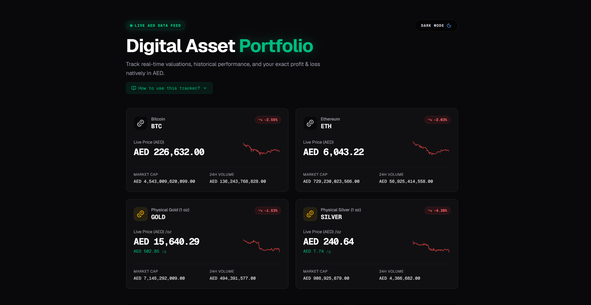

# Commodity Tracker & Digital Asset Portfolio

A beautifully designed, premium web application for tracking physical commodities (Gold, Silver) and digital assets (Bitcoin, Ethereum) natively in **AED (United Arab Emirates Dirham)**.

Built with Next.js 15, React 19, and Tailwind CSS v4.



## ✨ Key Features

- **Live Data Feed:** Fetches real-time price valuations, market caps, and 24h volumes via the CoinGecko API.
- **Native AED Conversion:** Automatically detects and safely pegs USD-dominated physical asset sparklines to exact AED valuations using live conversion rates.
- **Dual Tracking:** View Gold and Silver prices in both ounces (oz) and grams (g) simultaneously.
- **Advanced Portfolio Ledger:**
  - Add, edit, and remove manual transactions.
  - Automatically calculates live Cost Basis, Unrealized Profit/Loss (PnL), and PnL Percentages.
  - Generates 7-Day Macro Net Worth area charts based on your historic and current entries.
  - Calculates Capital Allocation weightings in an interactive Donut Chart.
- **Persistent Storage:** All portfolio positions are saved safely and locally to your browser's Local Storage. No database setup required!
- **Premium UI:**
  - System-synced Light & Dark modes with an animated, custom Theme Toggle.
  - Micro-animations, responsive hover tooltips for all sparkline graphs, and neon-emerald accents.
  - Fully responsive grid layout that looks perfect on both desktop and mobile.
- **PWA Ready:** Install the dashboard as a native-feeling app on your Desktop, iOS, or Android device directly from the browser URL bar.

---

## 🚀 Getting Started

### Prerequisites
Make sure you have [Node.js](https://nodejs.org/) installed on your machine.

### Installation

1. **Clone the repository**
   ```bash
   git clone https://github.com/arsxl/commodity-tracker.git
   cd commodity-tracker
   ```

2. **Install dependencies**
   ```bash
   npm install
   ```

3. **Run the development server**
   ```bash
   npm run dev
   ```

4. **Open the App**
   Open [http://localhost:3000](http://localhost:3000) with your browser to see the live dashboard!

---

## 🛠 Technologies Used

- **Framework:** [Next.js](https://nextjs.org/) (App Router)
- **UI Library:** [React](https://react.dev/)
- **Styling:** [Tailwind CSS v4](https://tailwindcss.com/)
- **Charts & Graphs:** [Recharts](https://recharts.org/)
- **Icons:** [Lucide React](https://lucide.dev/)
- **Theme Management:** [next-themes](https://github.com/pacocoursey/next-themes)
- **API:** [CoinGecko Public API](https://www.coingecko.com/en/api)

---

## 💡 How to Use

1. Click on **"How to use this tracker?"** at the top of the dashboard for a quick start guide.
2. The top ticker cards act as your **Live AED Data Feed**.
3. Use the **Transaction Ledger** to input your current holdings. Enter the asset, the quantity, and your exact purchase price in AED.
4. The dashboard will instantly visualize your Portfolio Value, Cost Basis, and Net Profit across the board. 

Enjoy your brand new digital portfolio!
